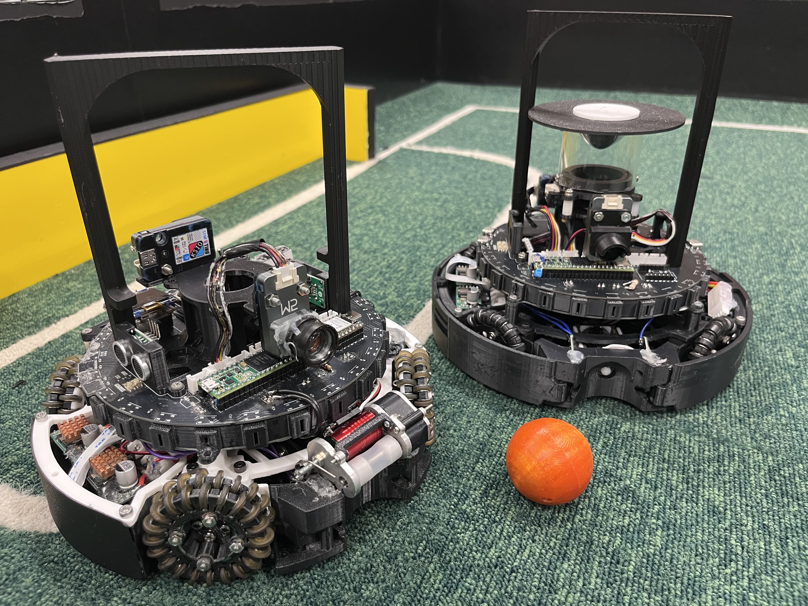

# AIR - RoboCupJunior2026 RobotData Repository

RoboCupJunior Soccer Lightweight 2026 シーズンにおいて、**ジャパンオープン優勝**、そして世界大会（韓国・仁川）で**競技優勝・総合優勝・コミュニティ賞**を達成したロボット「AIR」の**設計・開発データを公開するリポジトリ**です。

This repository contains the **design, hardware, and software data of AIR**, the **RoboCupJunior Soccer Lightweight 2026 Japan Open Champion and World Championship Champion**.

---
# 概要 / Overview

本リポジトリは、**次世代のRCJコミュニティおよび学生ロボティクスエンジニアへの情報共有**を目的として公開されています。

2026シーズンの開発で使用した**回路設計、組み込みソフトウェア、マルチマイコンによる分散処理システム、3D CADデータ**など、AIRのロボット開発に関する設計データを公開しています。

We open-source **AIR's robot design and development data** to support the global RCJ community and future student roboticists.

The repository includes **custom PCB designs, multi-MCU embedded firmware, and 3D CAD models** used in the development of AIR during the 2026 season.

---

<p align="center">
  
  
</p>

<p align="center">
  <b>Japan Open 2026</b>　　　　　　　　　<b>World Championship 2026</b>
</p>

---

# 大会実績 / Competition Results

* **RoboCupJunior Japan Open 2026**

  * 🥇 **競技 優勝 / 1st Place**

* **RoboCup World Championship 2026**

  * **Incheon, Republic of Korea**
  * 🥇 **競技 優勝 / Individual 1st Place**
  * 🏆 **総合 優勝 / Overall 1st Place**
  * 🏅 **コミュニティ賞 / Community Award**

---

# 技術的ハイライト / Technical Highlights

AIRのシステムは、**高速なセンサ処理と制御、複数のマイコンへの処理分散、そして競技環境での安定動作**を重視して設計されています。

* **Teensy 4.1を中心としたマルチマイコン分散処理**

  メインマイコンとして**Teensy 4.1**を使用し、複数のUARTを介してボール検出、ライン検出、壁面距離計測、UIなどの処理をサブマイコンへ分散しています。

* **24基のTSSP58038による高密度ボール検出**

  **RP2350Aと24個の赤外線センサ**を使用し、複数方向からのボール検出を高速に行います。得られたセンサ情報から**ボールの方向や距離を推定**し、ロボットの走行制御に利用しています。

* **FreeRTOSを用いた非ブロッキング超音波計測**

  **XIAO ESP32-S3上でFreeRTOSを利用**し、超音波センサによる壁面距離計測をメインの制御処理から分離しています。

* **電源・回路の安定性を重視した設計**

  **DCDCコンバータによる電源系統の分離**、大電流を扱うキッカー回路、複数のマイコン・センサ・モータドライバを統合した電源および信号系統を設計しています。

* **世界大会でのリモートシステムへの対応**

  **世界大会で使用された公式リモートシステム**に対応するための通信・制御機能を実装しています。

---

# リポジトリ構成 / Repository Structure

```text
.
├── Circuit/             # 回路・PCB設計データ (KiCad)
├── Hardware/            # 3D CAD・機械設計データ
├── Program/             # 組み込みソフトウェア・プログラム
├── PresentationSheet/   # プレゼンテーション・資料
├── .gitattributes
└── README.md
```

---

# ハードウェア仕様とシステム進化 / Hardware Architecture & Evolution

AIRのハードウェア構成は、**ジャパンオープンから世界大会（Incheon）にかけて大幅に進化**しました。

| ユニット / System              | Japan Open モデル                    | World Championship (Incheon) モデル |
| -------------------------- | --------------------------------- | -------------------------------- |
| **Main MCU**               | Teensy 4.1                        | Teensy 4.1                       |
| **Ball Sub MCU & Sensors** | ATmega32U4 + TSSP4038             | **RP2350A + TSSP58038 × 24**     |
| **Line Sub MCU & Sensors** | ATmega2560 + B19H1LS / LM393      | **RP2350B + B19H1LS / LM393**    |
| **Wall / US MCU**          | XIAO ESP32-S3                     | XIAO ESP32-S3                    |
| **UI & Remote Control**    | ESP32 WROOM-32E + OLED + NeoPixel | **XIAO ESP32-S3 + OLED**         |
| **Motor Driver**           | DRV8432                           | **DRV8432**                      |
| **Kicker System**          | CB1037 + Pch/Nch MOSFET           | **CB1037 + AQW212 + XL6009**     |
| **Power Distribution**     | LM2576系電源                         | **AP64500SP系電源**                 |

---

# ソフトウェア機能 / Software Architecture

主に**C/C++およびPython**を用いて開発された、**マルチマイコン分散処理によるロボット制御システム**です。

* **Ball Tracking**

  **24個のTSSP58038**から得られるセンサ情報をRP2350Aで高速処理し、**ボールの方向および距離を推定**します。

* **Line Keep**

  **B19H1LSおよびLM393**を使用したラインセンサシステムにより、フィールド上の白線を検出し、フィールド外への逸脱を防止します。

* **Wall Distance**

  ESP32-S3上で**FreeRTOS**を利用し、超音波センサによる壁面距離計測をバックグラウンドで実行します。

* **Motion Control**

  **IMU（BNO055）から得られる姿勢情報を利用したPIDベースの全方向移動制御**を行います。

* **Strategy State Machine**

  ボール検出、ライン検出、壁面距離、ロボットの状態などの情報をもとに、**試合中の動作を状態機械として制御**します。

* **World Championship Remote Control**

  **世界大会で使用された公式リモートシステムに対応した通信・制御機能**を実装しています。

---

# 開発環境・使用設備 / Development Environment & Equipment

### Software Tools

* **3D CAD**: Autodesk Fusion 360
* **EDA (PCB Design)**: KiCad
* **IDE / Programming**: Visual Studio Code / MaixPy IDE
* **Presentation & Media**: Canva

### Hardware & Manufacturing Equipment

* **3D Printers**: Bambu Lab A1 mini / Bambu Lab P1S / Flashforge Adventurer 5M
* **PCB Fabrication**: JLCPCB
* **Machining / Tools**: 小型CNC加工機

---

# CAD設計データ / CAD Models

AIRを構成する**カスタム機械部品をAutodesk Fusion 360で設計**しています。

主な設計データには以下が含まれます。

* **シャーシ構造** / Chassis
* **キッカーユニット** / Kicker Unit
* **センサマウント各種** / Sensor Mounts
* **オムニホイールモジュール** / Omni Wheel Modules
* **ドリブラー機構** / Dribbler Mechanism

---

# 公開基板データ / PCB Designs

ロボットに使用した**自作基板のKiCad設計データ**を公開しています。

## 日本大会機

1. **メイン基板 (`main_unit`)**
   各種マイコン・センサ・制御系を統合したメイン基板

2. **ボールセンサー基板 (`ball_unit`)**
   **TSSP4038およびATmega32U4**を搭載したボール検出基板

3. **ラインセンサー基板 (`line_unit`)**
   **B19H1LS、LM393、ATmega2560**を搭載したライン検出基板

4. **電源基板 (`power_unit`)**
   **LM2576**を使用した電源基板

5. **モータドライバ基板 (`md_unit`)**
   **DRV8432**を使用したモータドライバ基板

6. **キッカー制御基板 (`kicker_unit`)**
   キッカー用の**大電流スイッチング・絶縁回路**

## 世界大会機

1. **メイン基板 (`main_unit`)**
   各種マイコン・IMU・UIなどを統合したメイン基板

2. **ボールセンサー基板 (`ball_unit`)**
   **TSSP58038 × 24およびRP2350A**を搭載した高密度ボール検出基板

3. **ラインセンサー基板 (`line_unit`)**
   **B19H1LS、LM393、RP2350B**を搭載したライン検出基板

4. **電源基板 (`power_unit`)**
   **AP64500SP**を使用した電源基板

5. **モータドライバ基板 (`md_unit`)**
   **DRV8432**を使用したモータドライバ基板

6. **キッカー制御基板 (`kicker_unit`)**
   **昇圧回路、大電流スイッチング回路、AQW212**を使用したキッカー制御基板

---

# スポンサー / Sponsors

本プロジェクトの活動を支援していただいたスポンサー・団体の皆様に、心より感謝申し上げます。

* **JLCPCB**
  https://jlcpcb.com/

* **DigiKey**
  https://www.digikey.jp/

* **株式会社人機一体**
  https://www.jinki.jp/

* **MAXON**
  https://maxonjapan.com/

* **タカハ機工株式会社**
  https://www.takaha.co.jp/

* **株式会社システムアイインターナショナル**
  https://www.systemi.com/

* **ライフ&キャリアコンサルティング LACIQUE**
  https://www.lacique.com/

* **医療法人社団 翠会 水口病院**
  https://www.minakuchi-hp.or.jp/

* **JOJISTABLE**
  https://x.com/JojiStable

* **立命館守山高校 & 立命館大学**
  https://www.mrc.ritsumei.ac.jp/
  https://www.ritsumei.ac.jp/

---

# チーム情報・お問い合わせ / Team Information & Contact

## AIR

**RoboCupJunior Soccer Lightweight & Infrared Team from Japan**

**World Champion 2026**

### チーム実績 / Team History

* **2025 シーズン**

  * RoboCupJunior Japan Open 2025 🥉 **3位**
  * RoboCup World Championship 2025
    Salvador, Brazil 🥉 **Individual 3rd Place**

* **2026 シーズン**

  * RoboCupJunior Japan Open 2026 🥇 **優勝**
  * RoboCup World Championship 2026
    Incheon, Republic of Korea 🏆 **Individual 1st Place**
  * 🏅 **Community Award**

---

### お問い合わせ・ご質問 / Contact Information

本リポジトリの内容、設計データ、その他技術的なご質問やお問い合わせについては、以下よりご連絡ください。

* **X (Twitter) DM**: [@Air_Gamu_rcj](https://x.com/Air_Gamu_rcj)

* **Email**: [airkorea2026@gmail.com](mailto:airkorea2026@gmail.com)

### 公式メディア・SNS / Links

* **X (Twitter)**: [@Air_3838](https://x.com/Air_3838)

* **YouTube**: [AIR-RCJ Channel](https://www.youtube.com/@AIR-RCJ)

* **note**: [AIR Official note](https://note.com/air_rcj)
